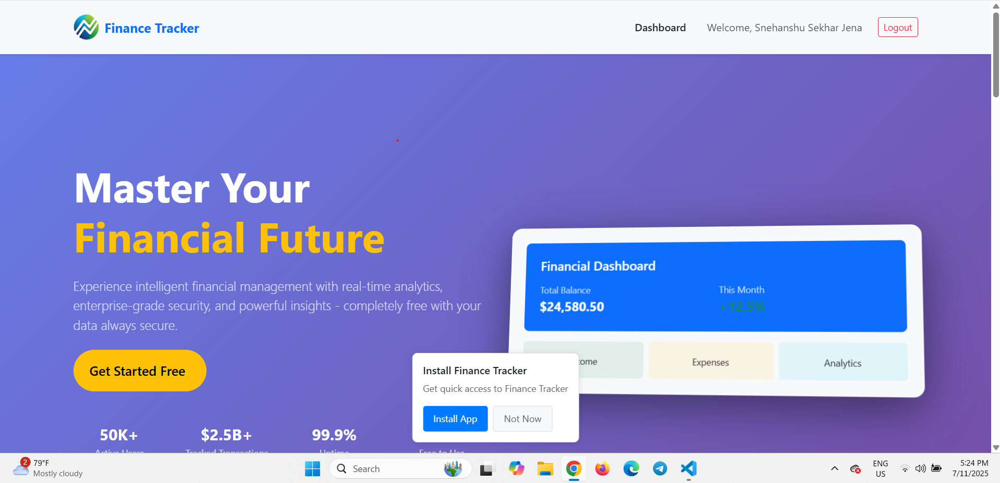

⚠️ **Educational Portfolio Repository** — Publicly available for demonstration purposes only.
Unauthorized copying, forking, or commercial use is strictly prohibited.
© 2026 Snehanshu Sekhar Jena. All rights reserved.

---

<div align="center">
 
# 💰 Finance Tracker
 
**A production-grade personal finance platform built with the MERN stack**


 
</div>

---

## 📸 Overview

Finance Tracker is a full-stack web application that gives users a complete picture of their financial health — real-time dashboards, smart transaction imports, goal tracking, AI-powered insights, and automated monthly reports delivered to their inbox.

---

## ✨ Features

### 💳 Transactions
- Full CRUD with filters, search, pagination, and bulk operations
- Smart auto-categorization (Food, Rent, Travel, etc.)
- Import from **PDF bank statements**, **CSV**, and **Excel** — with AI extraction
- Password-protected PDF support — unlock once, remembered permanently
- Recurring transactions with configurable frequency

### 📊 Dashboard & Analytics
- Real-time income vs expense charts with **Recharts**
- Monthly summaries, category breakdowns, spending trends
- Budget performance tracking with over-budget alerts
- Goals progress with deadline tracking

### 🤖 AI & RAG
- **Context-aware AI chat** about your finances using Google Gemini
- **RAG pipeline** — upload documents to your Vault, ask questions about them
- Vault supports PDF, CSV, XLSX — embeddings auto-generated every 5 minutes
- PII masking before embedding — sensitive data never stored in vector DB
- OCR fallback for scanned PDFs (page-level, mixed documents handled correctly)

### 📁 Document Vault
- Secure base64 document storage with 16MB limit
- In-browser PDF viewer with zoom, password unlock, spreadsheet renderer
- Download, delete, tag documents

### 🔐 Authentication
- JWT access + refresh token rotation via **HTTP-only cookies**
- **Google OAuth 2.0** login
- OTP email verification with expiry
- MFA-ready token architecture

### 📧 Automated Emails
- **Monthly financial report** PDF emailed on the 1st of every month (like a bank statement)
- Bill and goal reminders via scheduled jobs
- OTP verification emails
- Powered by **Resend**

### 📆 Google Calendar Sync
- Sync financial reminders directly to Google Calendar

---

## 🏗️ Architecture

```
┌─────────────────┐     ┌──────────────────┐     ┌──────────────────┐
│   React Frontend │────▶│   Node.js Server  │────▶│     MongoDB      │
│  Redux Toolkit   │     │  Express REST API │     │  Atlas (shared)  │
│   Bootstrap 5    │     │  JWT + OAuth 2.0  │     └──────────────────┘
└─────────────────┘     └──────────────────┘
         │                       │
         │               ┌───────────────────┐     ┌──────────────────┐
         └──────────────▶│  Analytics Server │────▶│  MongoDB (same)  │
                         │  GraphQL + Apollo │     └──────────────────┘
                         │  PDF Report Cron  │
                         └───────────────────┘
                                  │
                         ┌───────────────────┐     ┌──────────────────┐
                         │   Python AI Server│────▶│  MongoDB Atlas   │
                         │  FastAPI + RAG    │     │  Vector Search   │
                         │  Gemini Embedding │     └──────────────────┘
                         └───────────────────┘
```

**3 independent servers, 1 shared MongoDB Atlas cluster.**

---

## 🛠️ Tech Stack

| Layer | Technology |
|---|---|
| **Frontend** | React 18, Redux Toolkit, Bootstrap 5, Recharts, Axios |
| **Main Server** | Node.js, Express, Mongoose, JWT, Bcrypt, Resend |
| **Analytics Server** | Node.js, Apollo Server, GraphQL, PDFMake |
| **AI / RAG Server** | Python, FastAPI, LangChain, Google Gemini, Motor (async MongoDB) |
| **Database** | MongoDB Atlas (Vector Search enabled) |
| **Auth** | JWT (RS256), HTTP-only cookies, Google OAuth 2.0 |
| **Email** | Resend |
| **Deployment** | Render (all 4 services) |

---

## 📂 Project Structure

```
finance-tracker/
├── client/                  # React frontend
│   ├── src/
│   │   ├── app/             # Redux slices
│   │   ├── components/      # Reusable UI components
│   │   ├── pages/           # Route-level pages
│   │   ├── services/        # Axios service layer
│   │   └── utils/           # Auth, session, config
│
├── server/                  # Main Node.js server
│   ├── controllers/
│   ├── services/
│   ├── models/
│   ├── routes/
│   └── middleware/
│
├── analyticsServer/         # GraphQL + PDF report server
│   ├── graphql/
│   ├── services/            # Analytics, PDF, Email, Cron
│   └── routes/
│
└── chatServer/              # Python RAG + AI server
    ├── app/
    │   ├── ai/              # Gemini, RAG pipeline, embeddings
    │   ├── models/          # Pydantic schemas
    │   ├── services/        # Vault, embedding storage
    │   └── utils/           # PII masker, OCR
    └── main.py
```

---

## 🔑 Key Technical Decisions

| Decision | Reason |
|---|---|
| 3 separate servers | Isolation of concerns — AI/ML heavy work doesn't block API responses |
| Shared MongoDB Atlas | Single source of truth, Python reads what Node writes |
| RAG with cron polling | No webhook dependency — works across any deployment platform |
| Base64 vault storage | No S3 dependency for MVP, MongoDB 16MB doc limit enforced at schema level |
| `type="text"` for PDF password | `type="password"` triggers Chrome save-password — CSS `-webkit-text-security: disc` used for masking |
| Monthly report on analytics server | PDF generation is CPU-heavy — isolated from main API |

---

## 📡 API Overview

| Server | Base URL | Protocol |
|---|---|---|
| Main API | `/api/` | REST |
| Analytics | `/graphql` | GraphQL |
| AI / Chat | `/api/chat`, `/api/rag`, `/api/import` | REST |

---

## 🌐 Live

| | |
|---|---|
| 🔗 App | [https://financetracker.space](https://financetracker.space) |
| 📧 Contact | snehanshusekhar99@gmail.com |
| 💼 LinkedIn | [Snehanshu Sekhar Jena](https://linkedin.com/in/snehanshu-sekhar-jena-5365841a1) |

---

<div align="center">
  <sub>Built with ❤️ by <a href="https://linkedin.com/in/snehanshu-sekhar-jena-5365841a1">Snehanshu Sekhar Jena</a></sub>
</div>